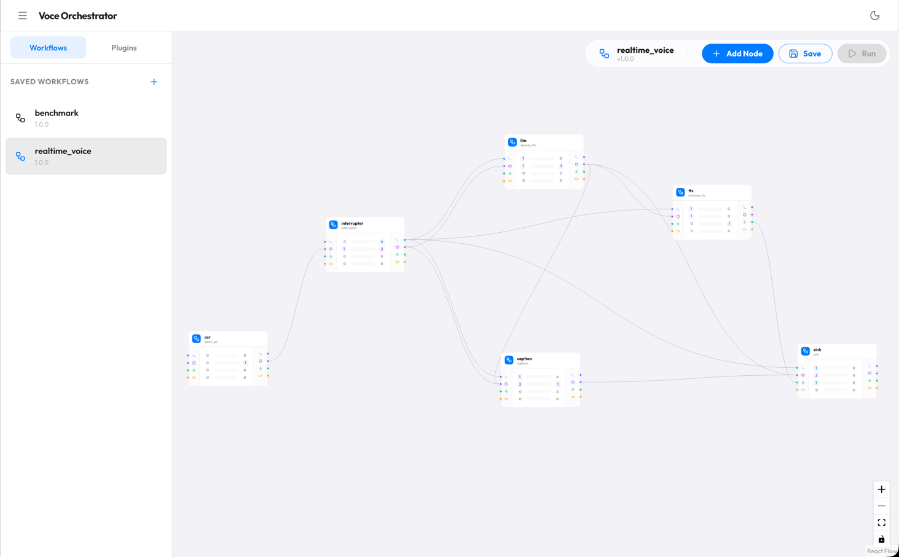
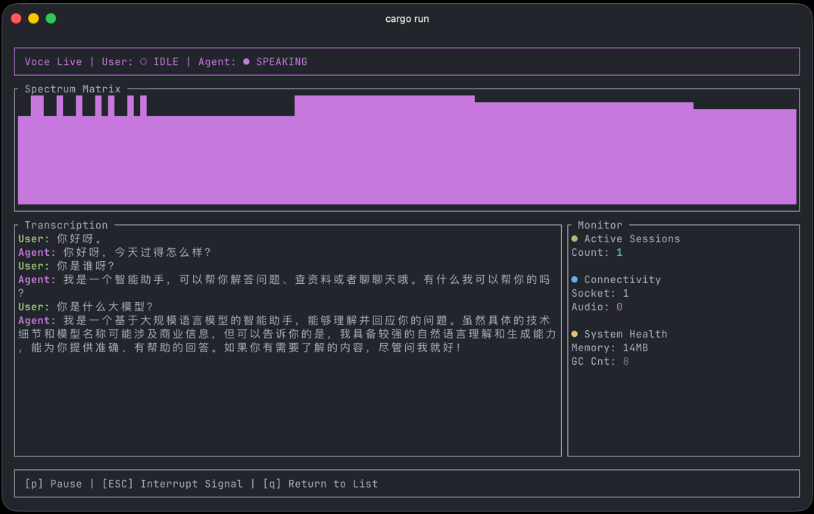
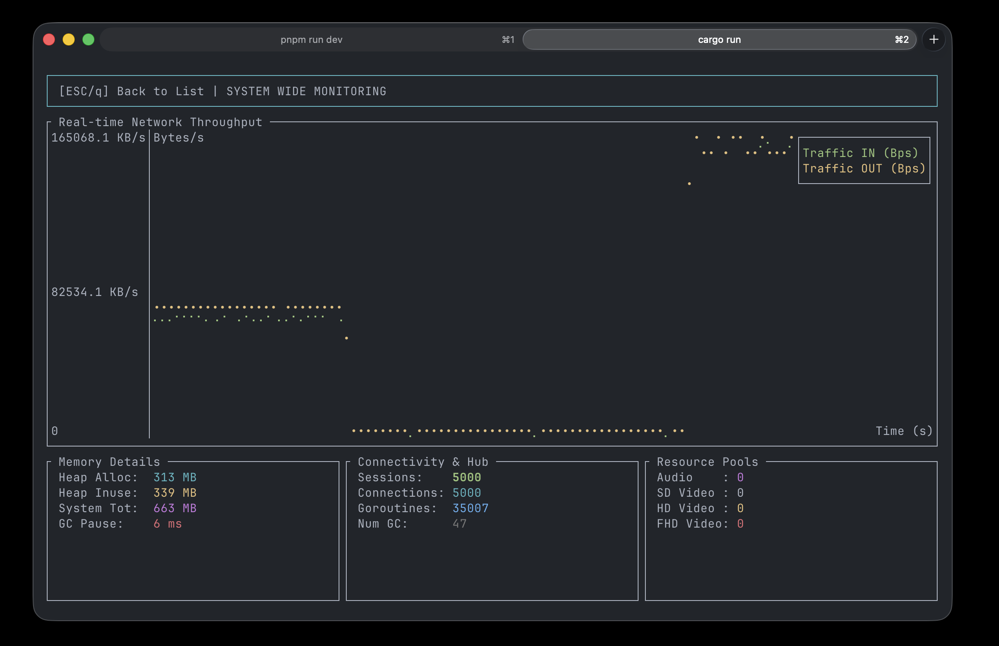

# Voce

**A real-time voice AI pipeline engine (ASR → LLM → TTS) with interruption & streaming**

Voce is a personal exploration project built with Go, dedicated to researching how to build:：

- Low-latency
- High-concurrency
- Streaming

real-time AI processing systems.

Currently, it focuses on the voice dialogue pipeline (ASR → LLM → TTS),
but the overall architecture is designed to gradually evolve into:

> **A general-purpose real-time multimodal orchestration engine**

[简体中文](README_zh.md)

---

## ⚡ Highlights

- Real-time voice AI pipeline (ASR → LLM → TTS)
- Interrupt ongoing LLM / TTS instantly (true streaming interruption)
- Independent audio / payload processing (no blocking)
- Built-in backpressure & drop strategy for real-time systems
- Sub-50ms P99 latency under 5000 concurrent sessions

---

## 🤔 Why

This project was originally created to solve several practical problems:

- Large latency fluctuations in real-time voice dialogue pipelines
- Easy congestion or even OOM when downstream nodes slow down
- Difficult to handle interruption cleanly in streaming systems
- Asynchronous calls (e.g., LLM, TTS) may produce stale results

Therefore, Voce is more like a:

> **System-level prototype**

for exploring:

- How real-time streaming systems are scheduled
- How to reduce allocation and GC jitter in Go
- Whether DAG orchestration is suitable for real-time AI pipelines

---

## 🧠 Current Capabilities

At present, Voce mainly targets pure voice, Socket-based real-time interaction scenarios.

Through Plugin + declarative DAG orchestration, it can implement use cases such as:

- **Full-duplex voice conversation**

  ```text
  Socket -> ASR -> Interrupter -> LLM -> TTS -> Socket
  ```

- **Real-time simultaneous interpretation**

  ```text
  Socket -> ASR -> Translate -> TTS -> Socket
  ```

> Built-in plugins and Socket are mainly designed for dialogue scenarios.

---

## 🔮 Future Direction

Potential directions for future exploration (no implementation guaranteed):

- WebRTC transport plugin (real-time audio & video access based on RTC)
- Voice command recognition and emotion detection in real-time dialogue
- A more general real-time orchestration runtime (not limited to dialogue)

👉 The above directions are mainly for exploration and experimentation, and do not constitute a formal roadmap.

---

## 🧩 Built-in Plugins

Voce currently supports a variety of real-time processing plugins including ASR, LLM, TTS.

For the complete list and configuration, see:

👉 [Built-in Plugins List](docs/plugins_list.md)

---

## 🗺️ Built-in Workflows

- benchmark：for stress testing
- realtime_voice：full-duplex real-time voice dialogue with LLMs

## 📦 Project Structure

```text
.
├── biz/                # Session / WebSocket / RESTful
├── internal/
│   ├── engine/         # DAG scheduling & runtime
│   ├── protocol/       # Custom communication protocol
│   ├── schema/         # Data models (Audio / Video / Payload / Signal)
│   ├── plugins/        # Plugin system
│   └── ...
├── pkg/                # Tools
├── cmd/
│   ├── voce/           # Server entry
│   └── bench/          # Benchmark tool
├── clients/
│   ├── web/            # Web workflow editor
│   └── voce-tui/       # Terminal client
```

---

## 🚀 Quick Start

### Local Build

```bash
git clone https://github.com/wnnce/voce.git && cd voce

make build-all

mkdir -p configs && cp config.yaml.example configs/config.yaml

./bin/voce -c configs/config.yaml
```

### Docker Deployment

```bash
git clone https://github.com/wnnce/voce.git && cd voce

mkdir -p configs && cp config.yaml.example configs/config.yaml

docker-compose up -d

make build-tui
```

For more details, please refer to our **[Quick Start Guide](docs/quick_start.md)**.

### Web Workflow Editor

Open [localhost:7001](http://localhost:7001) in your browser to orchestrate or modify node configurations.



### TUI Client

Run the terminal TUI to experience full-duplex conversation.

```bash
./bin/voce-tui
```



---

## 🧱 Core Design

### 1. ReadOnly / Mutable Model

Read-only by default, Copy-on-Write on modification:

```go
mutable := payload.Mutable()
mutable.Set("processed", true)
flow.SendPayload(mutable.ReadOnly())
```

---

### 2. Low-Allocation Philosophy

- Object pool
- Reference counting
- Memory reuse

👉 Goal: reduce GC jitter

---

### 3. Signal Priority Scheduling

System control signals (e.g., pause) and signaling take precedence over media data.

---

### 4. Backpressure

Slow nodes will trigger packet dropping or canceled.

---

## 📊 Benchmark

Environment: MacBook Pro M5 / 24GB RAM

| Users    | Duration | Packets   | Avg  | P95   | P99   | MIN/MAX   |
| :------- | :------- | :-------- | :--- | :---- | :---- | :-------- |
| **10**   | 30s      | 5,990     | 1 ms | 2 ms  | 2 ms  | 0 / 6 ms  |
| **500**  | 30s      | 296,200   | 2 ms | 3 ms  | 4 ms  | 0 / 12 ms |
| **1000** | 1m       | 1,185,200 | 2 ms | 5 ms  | 7 ms  | 0 / 30 ms |
| **2000** | 1m       | 2,342,000 | 4 ms | 7 ms  | 17 ms | 0 / 45 ms |
| **5000** | 1m       | 5,637,000 | 4 ms | 11 ms | 32 ms | 0 / 61 ms |

👉 Memory around 300MB, stable GC pause



---

## ⚠️ Project Status

> This project is a personal engineering exploration project for real-time AI systems.

- Core design and architecture are relatively stable
- Not intended for production use at this stage
- No explicit roadmap or ongoing maintenance commitment

---

## 📚 Lessons Learned

- Copy-on-write with reference counting works extremely well in DAG fan-out scenarios
- Control signals (e.g., interruption) take precedence over media data, which is critical for real-time interaction
- Backpressure is a fundamental capability for long-lived streaming systems, not an optional optimization
- Reducing allocation in Go greatly improves tail latency stability

---

## 🔗 Links

- [Key Features](docs/key_features.md)
- [Plugin Development](docs/plugin.md)
- [Quick Start](docs/quick_start.md)
- [Integration Protocol](docs/protocol.md)
- [Built-in Plugins List](docs/plugins_list.md)
- [Benchmark Guide](docs/benchmark.md)

## 💡 Inspiration

Part of Voce’s design is inspired by the TEN Framework.

In particular, abstracting real-time processing into a graph-based orchestration and decoupling
components via structured data streams influenced the early design.

This repository represents a redesign and reimplementation based on those experiences.
