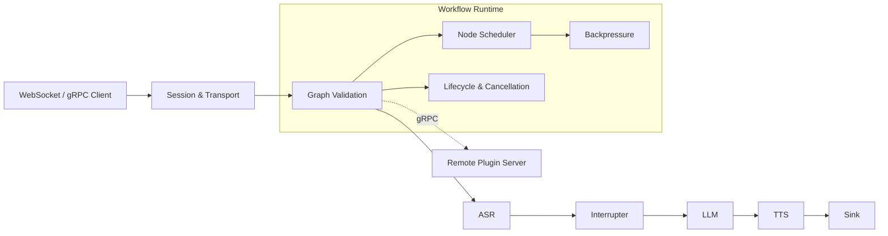

<div align="center">

# Voce

### A low-latency Go runtime for composable real-time voice AI pipelines

[](https://github.com/wnnce/voce/actions/workflows/ci.yaml)


[](https://deepwiki.com/wnnce/voce)

[Quick Start](#quick-start) · [Architecture](#architecture) · [Documentation](#documentation) · [简体中文](README_zh.md)

</div>

Voce runs streaming audio and structured data through declarative DAGs. It provides priority control signals, interruption, backpressure-aware media delivery, copy-on-write schemas, pluggable AI services, and session-aware gateway routing.

The project currently focuses on full-duplex voice applications built from ASR, LLM, and TTS services, while keeping the runtime independent from any single model provider.

> [!WARNING]
> Voce is an engineering exploration project. The Gateway and Remote Plugin APIs are experimental and may change without backward compatibility.

## Why Voce?

Real-time voice systems behave differently from request-response applications. Slow consumers accumulate latency, asynchronous model responses become stale after interruption, and media streams cannot be buffered indefinitely.

Voce treats these constraints as runtime concerns:

- **Declarative DAG runtime** — compose processing nodes through validated, typed edges rather than hard-coded pipelines.
- **Priority control path** — deliver interruption and lifecycle signals ahead of queued media data.
- **Backpressure-aware streaming** — preserve control and payload events while allowing stale audio or video frames to be dropped.
- **Explicit data ownership** — use read-only schemas, copy-on-write mutation, reference counting, and object pools to reduce allocation pressure.
- **Pluggable execution** — run local Go plugins or isolated Python and Node.js Remote Plugin servers.
- **Session-aware routing** — route long-lived client sessions through a dynamic Gateway-to-Machine connection pool.

## Architecture


```mermaid
flowchart LR
    Client[WebSocket / gRPC Client] --> Session[Session & Transport]
    Session --> Graph

    subgraph Workflow[Workflow Runtime]
        Graph[Graph Validation]
        Scheduler[Node Scheduler]
        Lifecycle[Lifecycle & Cancellation]
        Backpressure[Backpressure]
        Graph --> Scheduler
        Graph --> Lifecycle
        Scheduler --> Backpressure
    end

    Graph --> ASR
    ASR --> Interrupt[Interrupter]
    Interrupt --> LLM
    LLM --> TTS
    TTS --> Sink

    Graph -. gRPC .-> Remote[Remote Plugin Server]
```

Each Session owns an isolated Workflow instance. A Workflow validates its graph, starts plugin nodes in dependency order, routes typed events, and coordinates pause, resume, cancellation, and shutdown.

Two scheduling modes are available:

- `thread-per-node`: each node owns an isolated event loop.
- `worker-pool`: nodes share a bounded scheduler while preserving per-node serialization.

### Gateway mode

```text
Client
  │ WebSocket
  ▼
Gateway ── control connection ──► Machine registry
  │
  └──── dynamic data connection pool ────► Voce Machine
                                               │
                                               ▼
                                         Workflow runtime
```

The Gateway selects a Machine for each new Session and keeps its route stable. Data connections scale with Session load and preserve per-Session ordering. gRPC realtime streams currently connect directly to a Voce Machine and do not pass through the Gateway.

See [Gateway Architecture](docs/gateway.md) for connection lifecycle, routing, and current limitations.

## What You Can Build

### Full-duplex voice assistant

```text
Audio → ASR → Interrupter → LLM → Markdown Filter → TTS → Audio
```

### Realtime multimodal model

```text
Audio → VAD → Realtime MLLM → Audio / Transcript
```

### Streaming interpretation

```text
Audio → ASR → Translation LLM → TTS → Audio
```

The repository includes two example Workflows:

- `realtime_voice`: a complete streaming voice conversation.
- `benchmark`: a lightweight pipeline for runtime and transport load testing.

## Quick Start

### Requirements

- Go 1.27+
- Git
- FFmpeg development libraries (`libswresample` and `libavutil`)
- Node.js and pnpm for the embedded Workflow editor

Install the native audio dependencies:

```bash
# Ubuntu / Debian
sudo apt-get install libswresample-dev libavutil-dev

# macOS
brew install ffmpeg
```

### Build and run

```bash
git clone https://github.com/wnnce/voce.git
cd voce

mkdir -p configs
cp examples/voce-standalone.yaml.example configs/config.yaml

make build
./bin/voce -c configs/config.yaml
```

The example configuration starts:

- HTTP and WebSocket on `http://127.0.0.1:7001`
- gRPC on `127.0.0.1:7002`
- the embedded Workflow editor on `http://127.0.0.1:7001`

Verify the server:

```bash
curl http://127.0.0.1:7001/health
```

Create a Session using the built-in benchmark Workflow:

```bash
curl -X POST http://127.0.0.1:7001/sessions \
  -H 'Content-Type: application/json' \
  -d '{"name":"benchmark"}'
```

The response contains a `session_id`. Realtime WebSocket clients connect to `/realtime/{session_id}` using the binary format documented in [Integration Protocol](docs/protocol.md).

For provider-backed Workflows, configure the required API keys in the Workflow before creating a Session.

## See It in Action

### Workflow editor

The embedded editor discovers plugin JSON Schemas and renders Workflow nodes and configuration forms.


### Terminal client

Build the optional Rust TUI and connect it to the local server:

```bash
make build-tui
./bin/voce-tui
```


## Core Concepts

| Concept | Responsibility |
| --- | --- |
| **Session** | Owns one client interaction and its Workflow lifecycle. |
| **Workflow** | Runs a validated graph and coordinates nodes, scheduling, cancellation, and output. |
| **Node** | Wraps one Plugin instance and routes typed events to downstream nodes. |
| **Plugin** | Implements local or remote processing logic such as ASR, LLM, TTS, VAD, or filtering. |
| **Schema** | Carries Audio, Video, Payload, and Signal data with explicit ownership semantics. |
| **Scheduler** | Executes node events using isolated loops or a shared worker pool. |
| **Gateway** | Maintains Machine health, Session affinity, and dynamic data connection pools. |

Workflow definitions are JSON documents. Before execution, Voce verifies node identities, graph topology, and input/output contracts. See [Workflow and DAG](docs/workflow.md) for the complete format.

## Built-in Plugins

| Category | Plugins |
| --- | --- |
| ASR | Qwen ASR, Deepgram, Google Cloud Speech-to-Text |
| LLM | OpenAI-compatible chat completion providers |
| Realtime MLLM | Qwen Omni Realtime |
| TTS | MiniMax, ElevenLabs, OpenAI TTS |
| Control and utilities | Interrupter, TEN VAD, Caption, Markdown Filter, Sink |

Use [Plugin Development](docs/plugin.md) to implement a local Go plugin. Python and Node.js plugins can run as separate gRPC services through the experimental [Remote Plugin](docs/remote_plugin.md) runtime.

## API and Transports

| Endpoint | Purpose |
| --- | --- |
| `GET /health` | Process health check. |
| `GET /plugins` | List registered plugins and their schemas. |
| `GET /workflows` | List Workflow definitions. |
| `POST /sessions` | Create a Workflow Session. |
| `GET /sessions/health/{id}` | Read Session activity and Workflow state. |
| `POST /sessions/renew/{id}` | Renew an idle Session. |
| `DELETE /sessions/{id}` | Stop and remove a Session. |
| `GET /realtime/{id}` | Upgrade to the realtime WebSocket transport. |
| `GET /metrics` | Export OpenTelemetry metrics in Prometheus format. |

Voce also exposes a bidirectional gRPC stream defined in `api/voce/v1/voce.proto`.

## Observability

Voce uses OpenTelemetry Metrics and exposes process-local Prometheus endpoints. Runtime, Session, schema object, realtime transport, Gateway, and Machine connection-pool metrics are collected by their owning modules.

```bash
curl http://127.0.0.1:7001/metrics
```

Gateway and Machine processes expose their own `/metrics` endpoints; the Gateway does not aggregate Machine metrics. `GET /state` remains available on the Gateway for current Machine and connection-pool snapshots.

See [Monitoring and Metrics](docs/monitor.md) for the metric inventory and PromQL examples.

## Performance

The repository includes `cmd/bench`, which creates Sessions, opens realtime connections, sends timestamped audio packets, and measures end-to-end RTT and loss.

```bash
go run ./cmd/bench \
  -u 1000 \
  -d 1m \
  -i 50ms \
  -b 5 \
  -t http://127.0.0.1:7001
```

The benchmark Workflow uses lightweight forwarding and simulated I/O nodes. Results measure runtime, protocol, and Gateway overhead; they do not represent the capacity or latency of external ASR, LLM, or TTS services.

See [Benchmark Guide](docs/benchmark.md) for methodology, parameters, and historical results.

## Development

```bash
make build          # Build the web editor and Voce server
make build-gateway  # Build the experimental Gateway
make build-tui      # Build the terminal client
make test-backend   # Run all Go tests
make test-tui       # Run all Rust tests
make lint           # Run backend, web, and TUI linters
```

Repository layout:

```text
cmd/
  voce/             Standalone and Machine process
  gateway/          Gateway process
  bench/            Load generator
internal/
  engine/           Workflow graph, nodes, scheduler, and lifecycle
  schema/           Ref-counted streaming data types
  remote/           Remote Plugin client runtime
  gateway/          Gateway control and data planes
  machine/          Machine-side data connection handling
  telemetry/        OpenTelemetry and Prometheus setup
  plugins/          Built-in integrations
clients/
  web/              Workflow editor
  voce-tui/         Realtime terminal client and monitor
sdks/remote_plugin/ Python and Node.js Remote Plugin SDKs
```

## Documentation

| Guide | Description |
| --- | --- |
| [Quick Start](docs/quick_start.md) | Local and Gateway startup instructions. |
| [Key Features](docs/key_features.md) | Runtime capabilities and design summary. |
| [Workflow and DAG](docs/workflow.md) | Workflow schema, graph validation, and scheduling. |
| [Plugin Development](docs/plugin.md) | Plugin interfaces, properties, lifecycle, and testing. |
| [Built-in Plugins](docs/plugins_list.md) | Supported model providers and utility plugins. |
| [Integration Protocol](docs/protocol.md) | Session API, WebSocket packets, and gRPC transport. |
| [Gateway Architecture](docs/gateway.md) | Machine registration, routing, and connection pools. |
| [Remote Plugin](docs/remote_plugin.md) | Cross-language plugin runtime and SDK usage. |
| [Monitoring and Metrics](docs/monitor.md) | OpenTelemetry metrics and Prometheus queries. |
| [Benchmark Guide](docs/benchmark.md) | Load generator and benchmark methodology. |

## Project Status

The Workflow engine, schema model, scheduler, protocol, and plugin lifecycle are suitable for experimentation and extension. Gateway clustering and Remote Plugins remain experimental, and the project does not currently promise production support or a stable public API.

Before adopting Voce beyond development environments, review the documented Gateway limitations, add authentication around management endpoints, and validate the runtime with your own model providers and traffic profile.

## Inspiration

Voce was influenced by the [TEN Framework](https://github.com/TEN-framework/ten-framework), particularly its graph-based composition of realtime processing components. This repository is an independent redesign and implementation based on those ideas.
