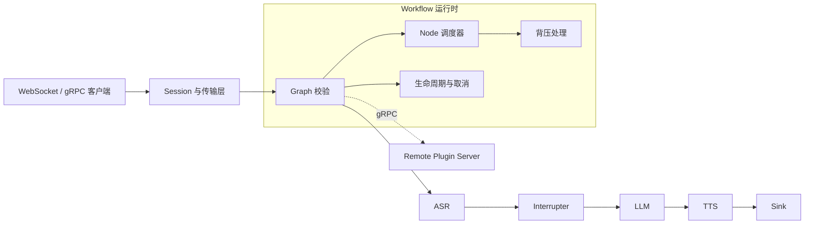
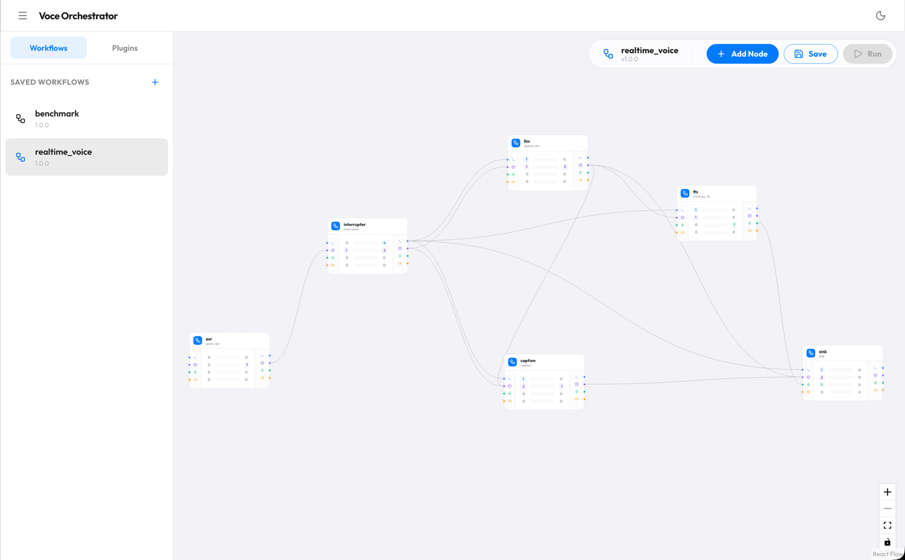
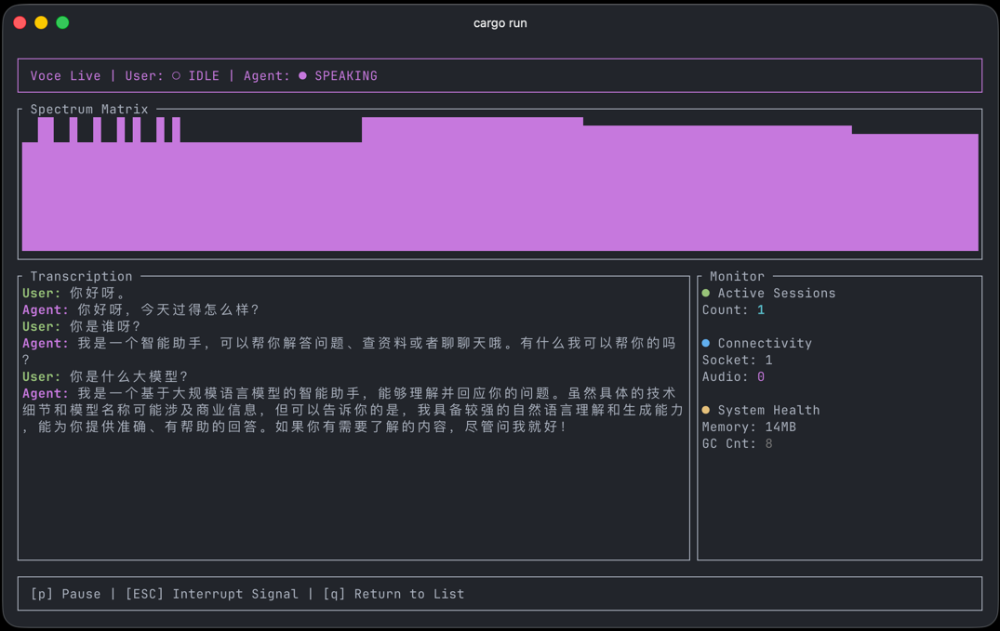

<div align="center">

# Voce

### 面向实时语音 AI 流水线的低延迟 Go 运行时

[](https://github.com/wnnce/voce/actions/workflows/ci.yaml)


[](https://deepwiki.com/wnnce/voce)

[快速开始](#快速开始) · [系统架构](#系统架构) · [项目文档](#项目文档) · [English](README.md)

</div>

Voce 通过声明式 DAG 处理流式音频和结构化数据，提供控制信令优先级、流式打断、背压感知的数据传递、写时复制 Schema、可插拔 AI 服务和具备 Session 路由能力的 Gateway。

项目当前主要面向由 ASR、LLM 和 TTS 组成的全双工语音应用，同时保持运行时与具体模型供应商解耦。

> [!WARNING]
> Voce 是一个工程探索项目。Gateway 和 Remote Plugin API 目前仍处于实验阶段，后续可能发生不向后兼容的变更。

## 为什么选择 Voce？

实时语音系统不同于普通的请求响应服务：下游变慢会让延迟持续累积，用户打断后异步模型仍可能返回过期结果，而媒体流也不能无限缓存。

Voce 将这些约束作为运行时的基础能力处理：

- **声明式 DAG 运行时**：通过经过校验的类型化边连接处理节点，而不是将流水线写死在业务代码中。
- **高优先级控制路径**：打断和生命周期信令优先于已经排队的媒体数据。
- **背压感知的流式处理**：控制信令和业务 Payload 保证传递，过期的 Audio 或 Video 帧允许在拥塞时丢弃。
- **明确的数据所有权**：通过只读 Schema、写时复制、引用计数和对象池降低高频数据处理的分配压力。
- **可插拔执行层**：支持本地 Go Plugin，也支持独立部署的 Python 和 Node.js Remote Plugin Server。
- **Session 路由**：通过动态 Gateway-Machine 数据连接池承载长连接 Session。

## 系统架构



每个 Session 拥有一个相互隔离的 Workflow 实例。Workflow 负责校验图结构、按依赖顺序启动 Plugin Node、路由类型化事件，并统一管理暂停、恢复、取消和停止。

运行时支持两种调度模式：

- `thread-per-node`：每个 Node 使用独立的事件循环。
- `worker-pool`：多个 Node 共享有界调度器，同时保持单个 Node 内部串行执行。

### Gateway 模式

```text
客户端
  │ WebSocket
  ▼
Gateway ── 控制连接 ──► Machine 注册表
  │
  └──── 动态数据连接池 ────► Voce Machine
                                  │
                                  ▼
                            Workflow 运行时
```

Gateway 为新 Session 选择 Machine，并在 Session 生命周期内保持路由稳定。数据连接池根据 Session 负载动态伸缩，同时保证单个 Session 的数据时序。当前 gRPC 实时流直接连接 Voce Machine，不经过 Gateway。

连接生命周期、路由机制和当前限制详见 [Gateway 架构](docs/gateway.md)。

## 可以构建什么？

### 全双工语音助手

```text
Audio → ASR → Interrupter → LLM → Markdown Filter → TTS → Audio
```

### 实时多模态模型

```text
Audio → VAD → Realtime MLLM → Audio / Transcript
```

### 实时同声传译

```text
Audio → ASR → Translation LLM → TTS → Audio
```

仓库内置两个示例 Workflow：

- `realtime_voice`：完整的流式语音对话流程。
- `benchmark`：用于运行时和传输层压测的轻量流水线。

## 快速开始

### 环境要求

- Go 1.27+
- Git
- FFmpeg 开发库（`libswresample` 和 `libavutil`）
- Node.js 和 pnpm，用于构建内嵌的 Workflow 编辑器

安装音频处理依赖：

```bash
# Ubuntu / Debian
sudo apt-get install libswresample-dev libavutil-dev

# macOS
brew install ffmpeg
```

### 构建并启动

```bash
git clone https://github.com/wnnce/voce.git
cd voce

mkdir -p configs
cp examples/voce-standalone.yaml.example configs/config.yaml

make build
./bin/voce -c configs/config.yaml
```

示例配置将启动：

- HTTP 和 WebSocket：`http://127.0.0.1:7001`
- gRPC：`127.0.0.1:7002`
- 内嵌 Workflow 编辑器：`http://127.0.0.1:7001`

检查服务状态：

```bash
curl http://127.0.0.1:7001/health
```

使用内置 `benchmark` Workflow 创建 Session：

```bash
curl -X POST http://127.0.0.1:7001/sessions \
  -H 'Content-Type: application/json' \
  -d '{"name":"benchmark"}'
```

响应中包含 `session_id`。WebSocket 客户端通过 `/realtime/{session_id}` 建立实时连接，二进制报文格式详见 [接入协议](docs/protocol.md)。

使用真实模型服务的 Workflow 前，需要先在 Workflow 配置中填写相应的 API Key。

## 界面预览

### Workflow 编辑器

内嵌编辑器会读取 Plugin JSON Schema，并渲染 Workflow Node 和配置表单。



### 终端客户端

构建可选的 Rust TUI，并连接本地服务：

```bash
make build-tui
./bin/voce-tui
```



## 核心概念

| 概念 | 职责 |
| --- | --- |
| **Session** | 管理一次客户端交互及其 Workflow 生命周期。 |
| **Workflow** | 运行经过校验的图，协调 Node、调度、取消和输出。 |
| **Node** | 封装一个 Plugin 实例，并将类型化事件路由到下游 Node。 |
| **Plugin** | 实现 ASR、LLM、TTS、VAD、过滤等本地或远程处理逻辑。 |
| **Schema** | 以明确的所有权语义承载 Audio、Video、Payload 和 Signal。 |
| **Scheduler** | 使用独立事件循环或共享 Worker Pool 调度 Node 事件。 |
| **Gateway** | 维护 Machine 健康状态、Session 路由和动态数据连接池。 |

Workflow 使用 JSON 描述。执行前，Voce 会校验 Node 标识、图拓扑以及输入输出契约。完整格式见 [Workflow 与 DAG](docs/workflow.md)。

## 内置 Plugin

| 分类 | Plugin |
| --- | --- |
| ASR | Qwen ASR、Deepgram、Google Cloud Speech-to-Text |
| LLM | OpenAI-compatible Chat Completion Provider |
| 实时 MLLM | Qwen Omni Realtime |
| TTS | MiniMax、ElevenLabs、OpenAI TTS |
| 控制与辅助 | Interrupter、TEN VAD、Caption、Markdown Filter、Sink |

开发本地 Go Plugin 请参考 [Plugin 开发指南](docs/plugin.md)。Python 和 Node.js Plugin 可以通过实验性的 [Remote Plugin](docs/remote_plugin.md) 运行时作为独立 gRPC 服务部署。

## API 与传输协议

| 接口 | 用途 |
| --- | --- |
| `GET /health` | 进程健康检查。 |
| `GET /plugins` | 获取已注册 Plugin 及其 Schema。 |
| `GET /workflows` | 获取 Workflow 定义。 |
| `POST /sessions` | 创建 Workflow Session。 |
| `GET /sessions/health/{id}` | 获取 Session 活跃时间与 Workflow 状态。 |
| `POST /sessions/renew/{id}` | 为闲置 Session 续期。 |
| `DELETE /sessions/{id}` | 停止并删除 Session。 |
| `GET /realtime/{id}` | 升级为实时 WebSocket 连接。 |
| `GET /metrics` | 以 Prometheus 格式导出 OpenTelemetry 指标。 |

Voce 同时提供定义在 `api/voce/v1/voce.proto` 中的双向 gRPC 实时流。

## 可观测性

Voce 使用 OpenTelemetry Metrics，并暴露进程级 Prometheus endpoint。Runtime、Session、Schema 对象、实时传输、Gateway 和 Machine 连接池指标均由所属模块自行采集。

```bash
curl http://127.0.0.1:7001/metrics
```

Gateway 和每个 Machine 分别暴露自己的 `/metrics`，Gateway 不聚合 Machine 指标。Gateway 继续提供 `GET /state`，用于查看当前 Machine 和连接池状态快照。

指标清单与 PromQL 示例见 [监控与指标](docs/monitor.md)。

## 性能测试

仓库内置 `cmd/bench`，它会创建 Session、建立实时连接、发送带时间戳的音频包，并统计端到端 RTT 与丢包情况。

```bash
go run ./cmd/bench \
  -u 1000 \
  -d 1m \
  -i 50ms \
  -b 5 \
  -t http://127.0.0.1:7001
```

`benchmark` Workflow 使用轻量转发和模拟 I/O Node。测试结果反映运行时、协议和 Gateway 的系统开销，不代表外部 ASR、LLM 或 TTS 服务的容量和延迟。

测试方法、参数和历史结果见 [压测说明](docs/benchmark.md)。

## 开发

```bash
make build          # 构建 Web 编辑器与 Voce 服务
make build-gateway  # 构建实验性 Gateway
make build-tui      # 构建终端客户端
make test-backend   # 运行全部 Go 测试
make test-tui       # 运行全部 Rust 测试
make lint           # 运行后端、Web 和 TUI Lint
```

项目目录：

```text
cmd/
  voce/             Standalone 和 Machine 进程
  gateway/          Gateway 进程
  bench/            压测工具
internal/
  engine/           Workflow Graph、Node、Scheduler 和生命周期
  schema/           使用引用计数的流式数据类型
  remote/           Remote Plugin 客户端运行时
  gateway/          Gateway 控制面与数据面
  machine/          Machine 侧数据连接处理
  telemetry/        OpenTelemetry 与 Prometheus 初始化
  plugins/          内置模型与辅助 Plugin
clients/
  web/              Workflow 编辑器
  voce-tui/         实时终端客户端与监控面板
sdks/remote_plugin/ Python 和 Node.js Remote Plugin SDK
```

## 项目文档

| 文档 | 内容 |
| --- | --- |
| [快速开始](docs/quick_start.md) | 本地模式与 Gateway 模式启动说明。 |
| [核心特性](docs/key_features.md) | 运行时能力与设计概览。 |
| [Workflow 与 DAG](docs/workflow.md) | Workflow Schema、图校验和调度机制。 |
| [Plugin 开发指南](docs/plugin.md) | Plugin 接口、属性、生命周期和测试。 |
| [内置 Plugin](docs/plugins_list.md) | 已支持的模型服务和辅助 Plugin。 |
| [接入协议](docs/protocol.md) | Session API、WebSocket 报文和 gRPC 传输。 |
| [Gateway 架构](docs/gateway.md) | Machine 注册、Session 路由与连接池。 |
| [Remote Plugin](docs/remote_plugin.md) | 跨语言 Plugin 运行时和 SDK。 |
| [监控与指标](docs/monitor.md) | OpenTelemetry 指标和 Prometheus 查询。 |
| [压测说明](docs/benchmark.md) | 压测工具与测试方法。 |

## 项目状态

Workflow Engine、Schema、Scheduler、协议和 Plugin 生命周期已经可以用于实验和扩展。Gateway 集群与 Remote Plugin 仍处于实验阶段，项目目前不承诺生产环境支持或稳定的公开 API。

在开发环境以外使用 Voce 前，请先阅读 Gateway 的已知限制，为管理接口增加认证，并使用自己的模型服务和流量模型完成验证。

## 灵感来源

Voce 的部分设计受到 [TEN Framework](https://github.com/TEN-framework/ten-framework) 启发，尤其是通过图结构组合实时处理组件的方式。本仓库是基于这些经验完成的独立设计与实现。
