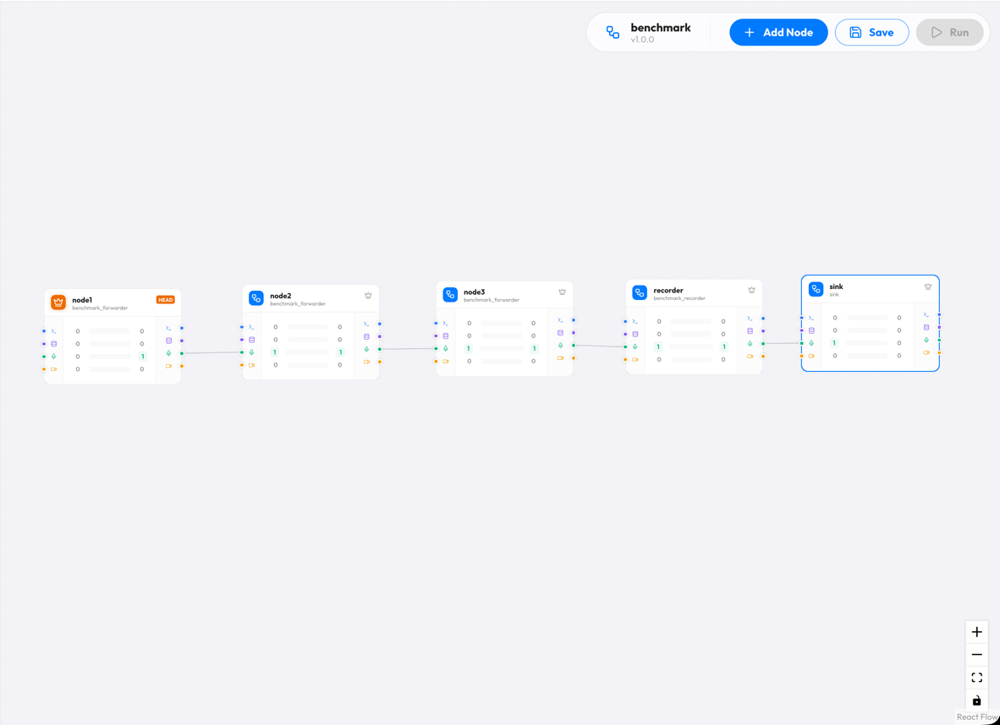

# 压测说明 (Benchmark Guide)

Voce 的 Benchmark 工具旨在模拟高并发下的真实媒体流处理链路，不仅测试单点吞吐量，更专注于在高负载下维持 **极低且稳定的尾延迟 (Tail Latency)**。

[benchmark.go](../cmd/bench/main.go) [benchmark plugin](../internal/plugins/benchmark/plugin.go)

## 1. 压测设计 (Design Principles)

> [!IMPORTANT]
> **注意**：此压测旨在模拟 **轻量级业务场景** 下 Voce 引擎的 **极限吞吐性能**。测试中的 Workflow 节点均为轻量级的转发和虚拟 I/O 节点，主要考察 DAG 调度、长连接多路复用、协议封装及内存管理的系统性开销。**这并不代表在加载了重型业务（如 ASR 语音识别、LLM 推理、TTS 语音合成）后的真实业务表现**，后者会受限于具体的计算资源（GPU/CPU）和模型推理延迟。

### Staggered Load (分批加载策略)

为了避免在测试开始瞬间产生巨大的并发冲击（Thundering Herd Problem），压测工具采用了 **Buckets (分批)** 机制：

- 5000 个用户被划分为 5 个 Bucket（每组 1000 人）。
- Bucket 之间的启动时间按发送间隔（Interval）进行错位平摊（如 50ms 间隔 / 5 组 = 每 10ms 启动一组）。
- 这种方式能更真实地模拟长连接服务的流量进入特征。

### 拓扑结构 (DAG Pipeline)

Benchmark 默认选用了 `benchmark` 这个特定的 Workflow， 其 DAG 路径如下：



- **转发节点 (Forwarder)**：纯透传，用于测试内部的节点调度。
- **记录节点 (Recorder)**：模拟 I/O 操作。它会将音频数据写入 `/dev/null`（模拟文件存储或分流）。
- 每个包在系统内部会经历 **5 次** 节点流转、状态切换和对象池回收。

### RTT 测量原理

- **数据包构造**：每个包大小为 1600 字节。
- **时间戳嵌入**：在音频 Payload 的前 8 个字节（BigEndian）嵌入发送时刻的 Unix 毫秒时间戳。
- **闭环计算**：当数据包经过 5 个 Node 并返回 Client 时，Client 通过解析时间戳计算端到端的 **RTT (Round Trip Time)**。

## 2. 压测数据回顾 (Performance Report)

### 压测环境规格 (Environment Specification)

测试使用 3 台**腾讯云计算型 C3** 实例，通过同一 VPC 内部网络互联（延迟 < 1ms）。

- **实例型号**：Tencent Cloud CVM C3.LARGE8 (计算型)
- **CPU**：Intel(R) Xeon(R) Gold 6146 (4 vCPU) @ 3.19 GHz
- **内存**：8GB DDR4
- **操作系统**：Debian GNU/Linux 13 (Trixie) x86_64 / Kernel 6.12
- **部署结构**：压测机、网关、业务服务器各占一台物理独立实例。

### 单机模式 (Standalone)
*Worker 直接处理客户端 WebSocket 连入*

| Users | Duration | Packets | Avg RTT | P95 RTT | P99 RTT | Min/Max RTT | 状态结论 |
| :--- | :--- | :--- | :--- | :--- | :--- | :--- | :--- |
| **100** | 30s | 59,640 | 1ms | 2ms | 2ms | 0/4ms | 极度流畅 |
| **500** | 30s | 291,700 | 2ms | 3ms | 4ms | 0/8ms | 极度流畅 |
| **1000** | 1m | 1,168,600 | 3ms | 5ms | 6ms | 0/19ms | 稳定运行 |
| **2000** | 1m | 2,274,000 | 6ms | 9ms | 11ms | 0/38ms | 稳定运行 |
| **3000** | 1m | 3,253,200 | 9ms | 16ms | 23ms | 0/88ms | **单机甜点位** |
| **4000** | 1m | 4,106,801 | 47ms | 65ms | 90ms | 1/436ms | 负载临界 |
| **5000** | 1m | 4,767,529 | 84ms | 177ms | 669ms | 0/4868ms | 开始卡顿 |

### 网关模式 (Gateway)
*客户端连接网关，网关通过长连接池的 16 条复用长连接转发至后端 Worker*

| Users | Duration | Packets | Avg RTT | P95 RTT | P99 RTT | Min/Max RTT | 状态结论 |
| :--- | :--- | :--- | :--- | :--- | :--- | :--- | :--- |
| **100** | 30s | 59,520 | 1ms | 3ms | 3ms | 1/7ms | 转发流畅 |
| **500** | 30s | 288,000 | 3ms | 5ms | 6ms | 1/10ms | 损耗极低 |
| **1000** | 1m | 1,152,357 | 5ms | 7ms | 10ms | 1/234ms | 稳定运行 |
| **2000** | 1m | 2,226,676 | 13ms | 19ms | 178ms | 1/469ms | **性能均衡点** |
| **3000** | 1m | 3,228,329 | 56ms | 98ms | 144ms | 3/526ms | 负载较重 |
| **4000** | 1m | 4,125,786 | 181ms | 368ms | 542ms | 4/1482ms | 转发压力大 |
| **5000** | 1m | 4,437,125 | 3.2s | 6.8s | 10.4s | 3/23404ms | 系统饱和 |

### 数据说明

1. **网关开销**：
   在 2000 并发下，网关模式相比单机模式仅增加了约 **7ms** 的平均延迟，转发效率较高。

2. **物理限制**：
   对于 4 核 8G 实例，当并发超过 **3000** 以后，CPU 上下文切换和系统调用（Syscall）频率达到瓶颈。单机 5 节点 Workflow 每秒涉及约 60 万次 Channel 调度，网关模式下更涉及 40w+/s 的系统调用。

3. **内存稳定性**：
   在 3000 并发负载下，Worker 节点堆内存常驻约为 **170MB - 300MB**。由于深度使用了 `sync.Pool` 对象复用，即使在 P99 抖动时，系统也未出现严重的 GC 停顿。

## 3. 如何使用 (Usage)

### 第一步：启动服务端

确保项目已编译并启动服务端：

### 第二步：运行压测工具

在项目根目录下通过 `go run` 启动：

```bash
go run cmd/bench/main.go -u 1000 -d 1m -b 5
```

### 可选参数说明

- `-u` (int): 并发用户数 (默认 10)
- `-d` (duration): 压测持续时间 (默认 20s)
- `-i` (duration): 每一个用户发送包的间隔 (默认 50ms)
- `-b` (int): 分批启动的桶数量 (默认 5)
- `-w` (string): 压测使用的 Workflow 名称 (默认 "benchmark")
- `-t` (string): 目标服务地址 (默认 "http://127.0.0.1:7001")
